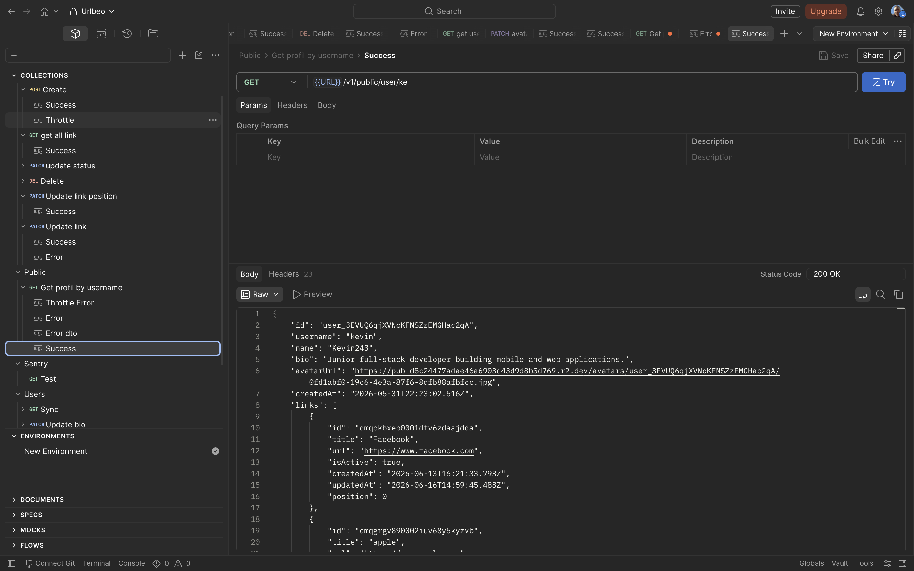

# Urlbeo Backend

Production-ready REST API backend built with NestJS and TypeScript for URL management and user operations.

**Landing Page**: [urlbeo.com](https://urlbeo.com)

## API Preview



## About Urlbeo

Urlbeo is a minimalist link management application designed to consolidate all your important links into a single, shareable URL. Similar to Linktree, Urlbeo allows users to create a personalized landing page and share it across social media and other platforms. Users can add links, organize them by changing their position, and perform full link management. The backend provides the API infrastructure for user authentication, link management, and storage.

## Overview

Urlbeo Backend is a scalable Node.js application designed to handle URL management, user authentication, and link operations. The project demonstrates best practices in backend development including structured logging, error tracking, health monitoring, and cloud deployment.

## Technology Stack

- **Framework**: NestJS 11.0.1 (TypeScript backend framework for Node.js)
- **Language**: TypeScript for type-safe development
- **Database**: Neon PostgreSQL with Prisma ORM for database access and migrations
- **Authentication**: Clerk for secure user authentication and session management
- **Storage**: Cloudflare R2 for file storage and CDN integration
- **Error Tracking**: Sentry for application error monitoring and reporting
- **Observability**: New Relic for performance monitoring, logs, and metrics in production
- **Structured Logging**: Pino for JSON-formatted logging with request correlation
- **Health Checks**: Terminus for liveness and readiness probes
- **Metrics**: Prometheus for application metrics and monitoring
- **Testing**: Jest with unit tests and end-to-end test coverage
- **Deployment**: GitHub Actions CI/CD pipeline with Heroku cloud hosting
- **Security**: Helmet for HTTP security headers, rate limiting with Throttler

## Runtime Overview

- **Node.js version**: 22
- **API base path**: `/api`
- **Production start command**: `npm run start:prod`
- **Prisma client generation**: handled automatically by the `postinstall` script
- **Database migrations**: handled by the Heroku release phase with `npm run prisma:migrate`

### API Documentation

Swagger UI is available in non-production environments at:

```text
http://localhost:3000/api
```

Use this page to browse the available endpoints, schemas, and request/response examples. In production, Swagger UI is disabled to avoid exposing the API surface publicly.

## Quality Gates

The project uses automated quality checks in CI before deployment:

- TypeScript compilation with the NestJS build pipeline
- ESLint for code quality and type-safety rules
- Jest unit tests
- End-to-end tests
- Production dependency audit with `npm audit --omit=dev`

## API Health Checks

The application provides three health check endpoints for monitoring:

- `GET /api/health/live` - Liveness probe, indicates if the application is running
- `GET /api/health/ready` - Readiness probe, verifies database connectivity
- `GET /api/health` - Alias for liveness check

## Architecture

### Modules

- **Users Module** - User profile management and data access
- **Links Module** - URL management, CRUD operations, and user link retrieval
- **Prisma Module** - Database connection and ORM integration
- **Authentication** - Clerk guard for request verification

### Key Features

- Service layer pattern for business logic separation
- Data Transfer Objects (DTOs) for request/response validation
- Error handling with Sentry integration for centralized error tracking
- Structured logging with Pino for request/response tracking
- Rate limiting to prevent abuse
- CORS configuration for cross-origin requests
- HTML content sanitization for user inputs

## Observability and Monitoring

### Error Tracking

Application errors are captured with Sentry for centralized error monitoring. The `captureServiceError` helper function provides consistent error reporting with contextual information including service name, operation, and user identification.

### Production Deployment

The application is configured to deploy on Heroku with integrated observability via New Relic, providing:

- Real-time application performance monitoring
- Log aggregation and analysis
- Custom metrics and dashboards
- Distributed tracing for request flows
- Alert capabilities for production incidents

### Configuration

For production deployment, configure the following environment variables on your hosting platform:

```
DATABASE_URL            # PostgreSQL connection string
NODE_ENV               # Set to 'production'
NEW_RELIC_LICENSE_KEY  # New Relic APM agent license
NEW_RELIC_APP_NAME     # Application name in monitoring dashboard
SENTRY_DSN             # Sentry error tracking DSN
SENTRY_ENVIRONMENT     # Environment identifier (production, staging, etc)
SENTRY_RELEASE         # Release version for error tracking
CLERK_SECRET_KEY       # Clerk authentication secret
CLOUDFLARE_ACCOUNT_ID  # Cloudflare account identifier
CLOUDFLARE_ACCESS_KEY  # Cloudflare R2 access key ID
CLOUDFLARE_SECRET_KEY  # Cloudflare R2 secret access key
CLOUDFLARE_BUCKET      # Cloudflare R2 bucket name
CORS_ORIGINS           # Allowed origin URLs for cross-origin requests
METRICS_TOKEN          # Bearer token required to access /metrics in production
```

For GitHub Actions deployment to Heroku, configure these repository secrets:

```
HEROKU_API_KEY         # Heroku API key used by the deployment workflow
HEROKU_APP_NAME        # Heroku application name
```

## CI/CD Pipeline

The project uses GitHub Actions for continuous integration and deployment:

- Automated testing on pull requests
- Automatic deployment to Heroku on updates to `main`
- The `main` branch must be protected so updates happen only through merged pull requests with passing CI
- The deployment workflow reruns lint, tests, build, and production dependency audit before publishing
- Prisma migrations handled by the Heroku release phase during deployment
- Build validation before deployment to production
- Heroku dashboard automatic deploys should remain disabled so GitHub Actions stays the single deployment path

## Project Structure

```
src/
  main.ts                    # Application entry point
  app.controller.ts          # Main controller with health endpoints
  app.service.ts             # Application service
  app.module.ts              # Root module configuration

  links/                     # URL management feature module
    links.controller.ts      # HTTP endpoints for link operations
    links.service.ts         # Business logic for link management
    links.module.ts          # Links feature module

  users/                     # User management feature module
    users.controller.ts      # HTTP endpoints for user operations
    users.service.ts         # Business logic for user data
    users.module.ts          # Users feature module

  prisma/                    # Database integration
    prisma.service.ts        # Database connection management
    prisma.module.ts         # Database module

  guards/                    # Authentication guards
    clerk-auth.guard.ts      # Clerk authentication verification

  helpers/                   # Utility functions
    sentry-service-error.ts  # Centralized error capture for Sentry
    handle-prisma-error.ts   # Database error handling
    log-service.ts           # Logging utilities

  dto/                       # Data transfer object definitions
  types/                     # TypeScript type definitions
  pipes/                     # Custom NestJS pipes
  decorators/                # Custom decorators

prisma/
  schema.prisma              # Database schema definition
  migrations/                # Database migration history
```

## License

This project is private and proprietary.
